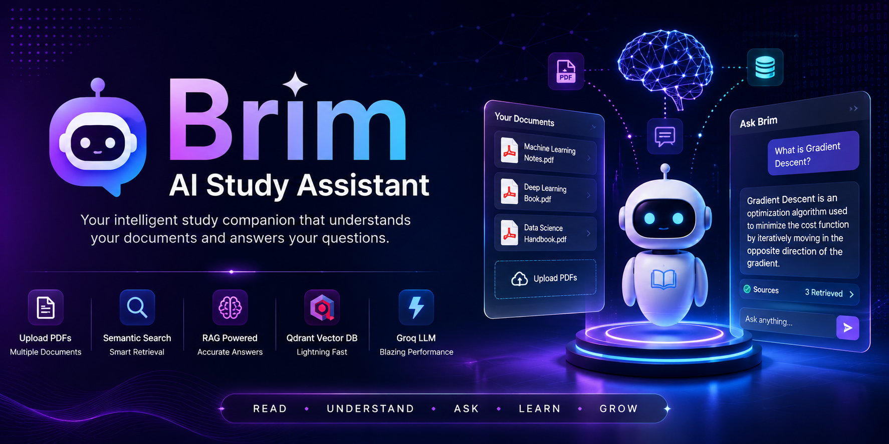

<p align="center">

</p>


# 🤖 Brim – AI Study Assistant

Brim is an AI-powered Study Assistant that allows users to upload one or multiple PDF documents and ask questions in natural language. It uses Retrieval-Augmented Generation (RAG) to retrieve relevant information from uploaded documents before generating accurate answers using Groq LLM.

---

# 🚀 Features

- Multiple PDF Upload
- Semantic Search using Vector Embeddings
- Retrieval-Augmented Generation (RAG)
- Qdrant Vector Database
- Sentence Transformer Embeddings
- Groq LLM Integration
- Conversation Memory
- Chat History
- Clear Chat Button
- Retrieved Context Viewer
- Streamlit Interactive UI

---

# 🏗️ System Architecture

```text
                PDF Upload
                     │
                     ▼
             PDF Text Extraction
                     │
                     ▼
             Text Chunking
                     │
                     ▼
          Sentence Embeddings
                     │
                     ▼
          Qdrant Vector Database
                     │
              Semantic Search
                     │
          Top-K Relevant Chunks
                     │
                     ▼
             Prompt Engineering
                     │
                     ▼
              Groq LLM
                     │
                     ▼
             Final AI Response
```

---

# ✨ Tech Stack

## Frontend

- Streamlit

## Backend

- Python

## LLM

- Groq API
- Llama 3.3

## Vector Database

- Qdrant

## Embedding Model

- Sentence Transformers
- all-MiniLM-L6-v2

## Libraries

- LangChain Text Splitters
- PyPDF
- NumPy
- Python Dotenv

---

# 📂 Project Structure

```text
AI_Study_Assistant
│
├── rag_backend
│   ├── Chunking.py
│   ├── config.py
│   ├── Embeddings.py
│   ├── llm.py
│   ├── pdf_loader.py
│   ├── rag_pipeline.py
│   ├── Retriever.py
│   └── vector_store.py
│
├── rag_frontend
│   ├── app.py
│   └── styles.css
│
├── qdrant
│
├── .env
├── requirements.txt
├── README.md
└── pyproject.toml
```

---

# ⚙️ Installation

Clone the repository

```bash
git clone <your-github-link>
```

Go inside the project

```bash
cd AI_Study_Assistant
```

Install dependencies

```bash
pip install -r requirements.txt
```

Create a `.env` file

```env
GROQ_API_KEY=YOUR_API_KEY
```

Run the application

```bash
streamlit run rag_frontend/app.py
```

---

# 💬 How It Works

1. Upload one or multiple PDF files.
2. PDFs are converted into text.
3. Text is split into chunks.
4. Chunks are converted into embeddings.
5. Embeddings are stored inside Qdrant.
6. User asks a question.
7. Semantic search retrieves Top-K relevant chunks.
8. Retrieved context is passed to Groq LLM.
9. Brim generates the final answer.

---

# 📊 Evaluation

Brim V1 was evaluated using a dedicated benchmark containing 24 questions, including 22 answerable and 2 unanswerable questions.

The evaluation was performed in two stages.

## 1. Retrieval Evaluation

Retrieval quality was evaluated using:

- Hit@1
- Hit@3
- Hit@5
- Mean Reciprocal Rank (MRR)

### Retrieval Results

| Metric | Result |
|--------|--------|
| Hit@1  | 95.45% |
| Hit@3  | 100%   |
| Hit@5  | 100%   |
| MRR    | 0.9773 |

The retrieval evaluation uses exact evidence matching and sentence-level semantic matching to determine whether relevant evidence was successfully retrieved.

## 2. Generation Evaluation

Generated answers were evaluated using an LLM-based judge against reference answers and retrieved evidence.

The evaluation measured:

- Correctness
- Faithfulness
- Relevance
- Abstention on unanswerable questions

### Generation Results

| Metric              | Result        |
|---------------------|---------------|
| Correctness         | 100% (5/5)    |
| Faithfulness        | 98.4% (4.92/5)|
| Relevance           | 100% (5/5)    |
| Abstention Accuracy | 100% (2/2)    |

These results indicate that Brim V1 successfully retrieves relevant evidence and generates highly grounded and relevant responses.

---

# ✨ Current Capabilities

- PDF Question Answering
- Multiple Document Support
- Semantic Retrieval
- Context Based Responses
- Conversation Memory
- Chat History
- Clear Chat

---

# 🔮 Future Improvements

- Modern Glassmorphism UI
- Voice Input
- Voice Output
- OCR Support
- Image Understanding
- Hybrid Search
- Source Highlighting
- Web Search Integration
- Multi-Agent Architecture
- Docker Deployment

---

# 📸 Screenshots

Coming Soon...

---

# 🤝 Contributions

Contributions are always welcome.

Feel free to fork the repository and submit a Pull Request.

---

# 📄 License

This project is developed for educational and portfolio purposes.

---

# 👨‍💻 Author

**Sehaj Vij**

Aspiring AI Engineer | Data Scientist

Built with using Python, Streamlit, Groq and Qdrant.